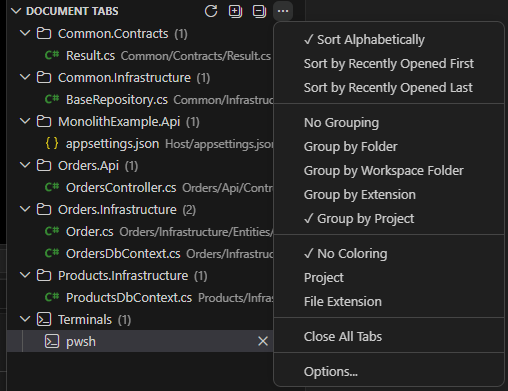
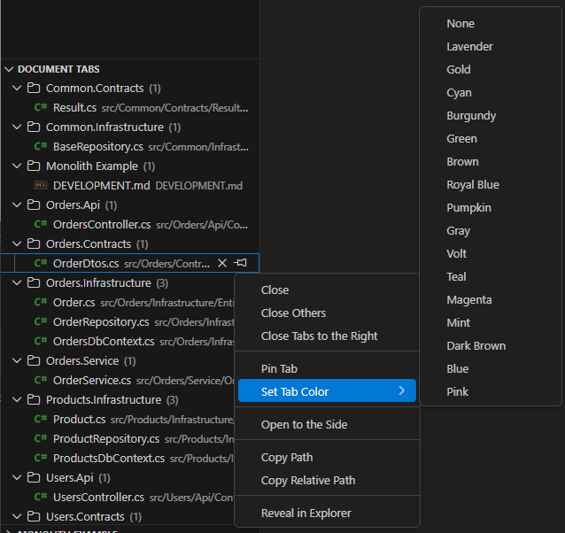

# Document Tabs

A Visual Studio-style vertical tab grouping view for VS Code. This extension provides a custom sidebar view showing all currently open tabs with powerful grouping, sorting, and tab management features.

## Screenshots

### View Menu

### Context Menu Actions

## Features

### 📁 Tab Grouping

- **Group by Folder** - Organize tabs by their parent folder
- **Group by Extension** - Organize tabs by file type (.ts, .js, .css, etc.)
- **Group by Project** - Organize tabs by detected project (best-effort)
- **No Grouping** - Show a flat list of all tabs

### 🔤 Tab Sorting

- **Alphabetical** - Sort tabs A-Z by filename
- **Recently Opened First** - Most recently opened tabs at the top
- **Recently Opened Last** - Most recently opened tabs at the bottom

### 📌 Pinned Tabs

- Pin important tabs to keep them at the top
- Pinned tabs are shown in a separate group
- Pinned tabs are protected from "Close Others" actions

### ⚡ Quick Actions

- **Click** to open/focus a tab
- **Close** individual tabs or groups
- **Close Others** - Close all tabs except the selected one
- **Close Tabs to the Right** - Close tabs after the selected one
- **Open to the Side** - Open in a split editor
- **Copy Path** - Copy full file path to clipboard
- **Copy Relative Path** - Copy workspace-relative path
- **Reveal in Explorer** - Show file in the Explorer view

### 🎨 Visual Indicators

- File icons based on file type
- Dirty indicator (●) for unsaved files
- Tab count badge on the view
- File path shown in description

## Usage

1. Click the **Document Tabs** icon in the Activity Bar (left sidebar)
2. View all your open tabs organized in the sidebar
3. Click any tab to open it in the editor
4. Right-click for context menu actions
5. Use the view title actions/menu for sorting, grouping, refresh, and **Expand All**

## Configuration

Open **Settings** and search for "Document Tabs", or run **Document Tabs: Options...** from the Command Palette.

| Setting | Default | Description |
|---------|---------|-------------|
| `documentTabs.sortOrder` | `alphabetical` | How to sort tabs (alphabetical, recentlyOpenedFirst, recentlyOpenedLast) |
| `documentTabs.groupBy` | `folder` | How to group tabs (none, folder, extension, project) |
| `documentTabs.showPinnedSeparately` | `true` | Show pinned tabs in a separate group |
| `documentTabs.showTabCount` | `true` | Show tab count in the view badge |
| `documentTabs.showDirtyIndicator` | `true` | Show indicator for unsaved files |
| `documentTabs.showFileIcons` | `true` | Show file icons |
| `documentTabs.showPath` | `true` | Show file path in description |
| `documentTabs.collapseGroupsByDefault` | `false` | Start with groups collapsed |

## Keyboard Shortcuts

You can assign keyboard shortcuts to Document Tabs commands:

1. Open **Keyboard Shortcuts** (Ctrl+K Ctrl+S)
2. Search for "Document Tabs"
3. Assign your preferred shortcuts

## Commands

All commands are available in the Command Palette (Ctrl+Shift+P):

- `Document Tabs: Refresh`
- `Document Tabs: Expand All`
- `Document Tabs: Options...`
- `Document Tabs: Sort Alphabetically`
- `Document Tabs: Sort by Recently Opened First`
- `Document Tabs: Sort by Recently Opened Last`
- `Document Tabs: No Grouping`
- `Document Tabs: Group by Folder`
- `Document Tabs: Group by Extension`
- `Document Tabs: Group by Project`
- `Document Tabs: Close All Tabs`

## Requirements

- VS Code version 1.85.0 or higher

## Known Limitations

- Cannot modify the built-in VS Code tab bar appearance
- Cannot add multi-row tabs to the built-in tab bar
- Tab color customization is limited to what VS Code theming allows

## Contributing

Found a bug or have a feature request? Please open an issue on our GitHub repository.

## License

MIT License - see LICENSE file for details.
